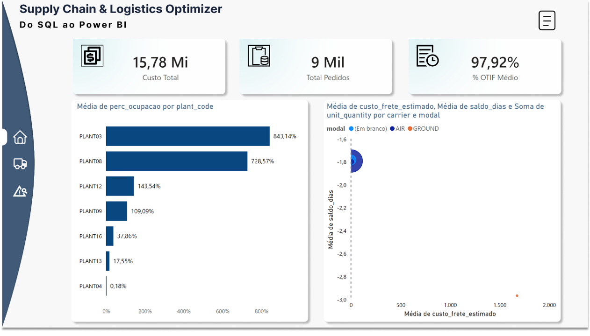
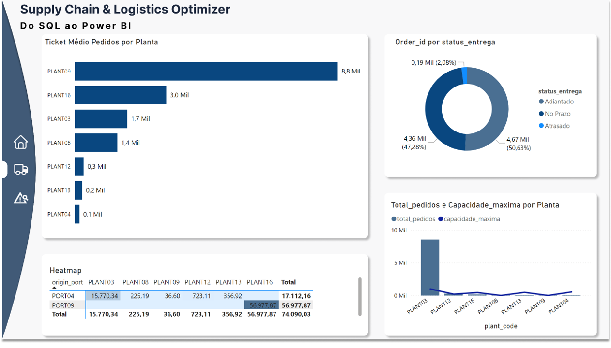
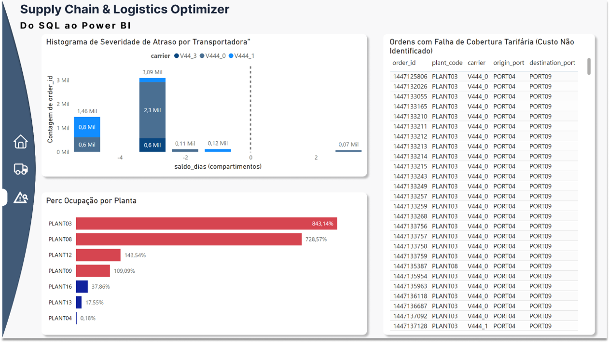

# 🚚 Supply Chain & Logistics Optimizer: Do SQL ao Power BI

Este projeto apresenta uma solução completa de **Data Analytics** voltada para a gestão de uma malha logística global. Utilizando dados de 19 plantas industriais, o objetivo foi transformar registros brutos em um ecossistema de inteligência para controle de custos, nível de serviço (SLA/OTIF) e capacidade produtiva.



## 📁 Sobre os Dados
Os dados utilizados neste projeto são provenientes de um dataset público voltado para problemas de Supply Chain:
*   **Fonte:** [Supply Chain Logistics Problem Dataset](https://brunel.figshare.com/articles/dataset/Supply_Chain_Logistics_Problem_Dataset/7558679?file=20162015)
*   **Conteúdo:** 7 tabelas contendo registros históricos de pedidos, capacidades de armazenamento, custos fixos e variáveis, e restrições de portos.

---

## 🛠️ Tecnologias e Arquitetura
*   **Banco de Dados:** PostgreSQL (Migração de SQLite e Modelagem Relacional).
*   **Engenharia de Dados:** SQL (DBeaver / pgAdmin4).
*   **Business Intelligence:** Power BI Desktop (Conectado via PostgreSQL).
*   **Metodologia:** Arquitetura de camadas com Views para processamento em banco de dados.

---

## 🏗️ Engenharia de Dados (O Coração do Projeto)

A base de dados apresentava desafios críticos de limpeza e granularidade. Abaixo, destaco as principais lógicas implementadas via SQL para garantir a integridade da análise:

### 1. Deduplicação e Limpeza de Fretes
Muitas tarifas de frete possuíam duplicidade devido a variações no tempo de trânsito. Utilizei `DISTINCT ON` para garantir que apenas a tarifa válida (com menor tempo) fosse considerada, evitando a inflação de custos.

```sql
/* Exemplo da lógica de limpeza e cálculo de custo na View vw_custos_totais */
CREATE OR REPLACE VIEW vw_custos_totais AS
WITH frete_unico AS (
    SELECT DISTINCT ON (carrier, orig_port_cd, dest_port_cd, svc_cd, minm_wgh_qty, max_wgh_qty) *
    FROM freightrates
    ORDER BY carrier, orig_port_cd, dest_port_cd, svc_cd, minm_wgh_qty, max_wgh_qty, tpt_day_cnt ASC
)
SELECT 
    o.order_id,
    f.mode_dsc AS modal,
    -- Limpeza de caracteres especiais ($) e conversão para NUMERIC
    COALESCE(
        CAST(REPLACE(REGEXP_REPLACE(f.minimum_cost, '[^0-9,.]', '', 'g'), ',', '.') AS NUMERIC) + 
        (CAST(o.weight AS NUMERIC) * CAST(REPLACE(REGEXP_REPLACE(f.rate, '[^0-9,.]', '', 'g'), ',', '.') AS NUMERIC)),
        0
    ) AS custo_frete_estimado
FROM orderlist o
LEFT JOIN frete_unico f ON o.carrier = f.carrier 
    AND o.origin_port = f.orig_port_cd 
    AND o.destination_port = f.dest_port_cd;
```

### 2. Normalização de Granularidade (Capacidade)
A capacidade das plantas era medida em **Pedidos/Dia**, mas a demanda estava em **Itens**. Criei uma camada de agregação para isolar pedidos únicos (`DISTINCTCOUNT`), garantindo que o KPI de ocupação fosse fiel à realidade operacional.

---

## 📊 Business Insights e Dashboards

### 1. Visão Executiva e Malha Logística
Utilizei um **Heatmap (Matriz de Calor)** para mapear o escoamento entre Fábricas e Portos. Esta visão revelou que a **PLANT16** é o principal pilar de volume, mas possui rotas com altos custos.



### 2. Auditoria e Diagnóstico de Riscos (SLA)
Desenvolvi uma página focada em **Gestão de Exceções**:
*   **Gargalos Produtivos:** Alertas visuais para plantas operando acima de 100% da capacidade (ex: PLANT03 e 08).
*   **Análise de Severidade de Atraso:** Um histograma que separa pequenos desvios de falhas logísticas graves por transportadora.
*   **Gap de Cobertura:** Identificação de pedidos sem tarifa de frete contratada, expondo riscos de custos *spot*.



---

## 🧠 Conclusão de Negócio
O projeto demonstrou que a operação possui um excelente **OTIF (97%)**, porém sob alto risco. A sobrecarga extrema em fábricas específicas e a falta de cobertura tarifária em certas rotas indicam oportunidades imediatas de economia e redistribuição de carga.

---

## 🛠️ Como reproduzir este projeto
1.  Execute os scripts contidos na pasta `/sql` no seu ambiente **PostgreSQL**.
2.  Abra o arquivo `.pbix` no **Power BI** e atualize a fonte de dados para o seu `localhost`.

